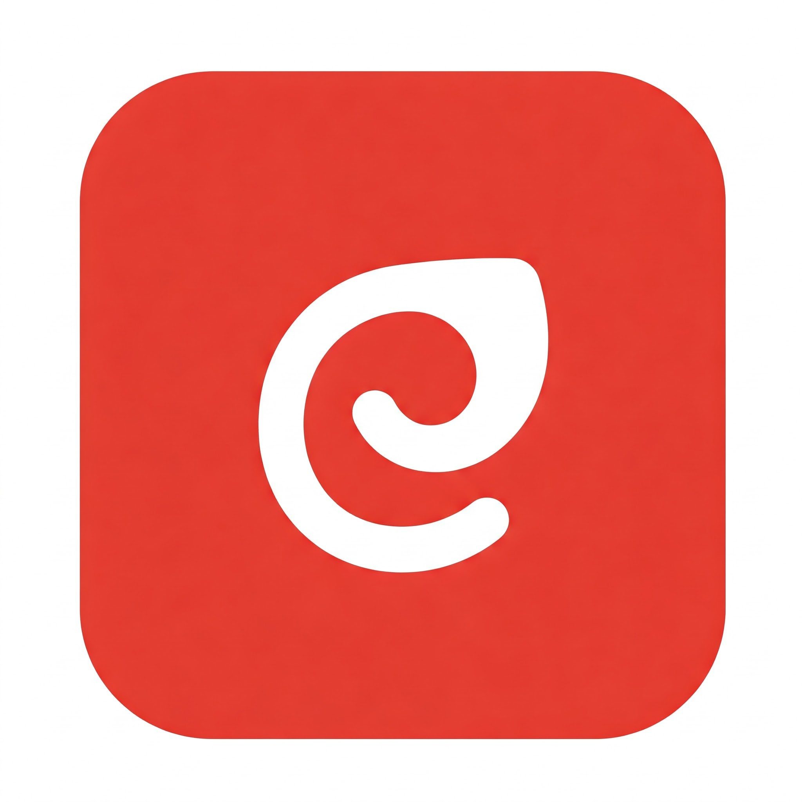

<h1 align="center">
📌 Reply App - Navigation Update Starter Code
</h1>

    
    
    
    
    
    
    

## ⭐ Introduction

The Reply App isn't just any email app; it's a deliberately simplified email client designed to showcase adaptive layouts. This means it's built to demonstrate how an application's user interface can dynamically adjust and respond effectively to different screen sizes and orientations. The fact that it displays "various categories of your inbox" provides the content structure that these adaptive layout principles can be applied to. The Navigation Update Starter Code you mentioned earlier would then be a specific set of tools or a foundation aimed at modifying how users move between these inbox categories within this adaptive layout context.

## 👇 Pre-requisites

* Experience with Kotlin syntax
* How to create and run a project in Android Studio
* How to create composable functions
* How to create compose navigation

## 🎉 Getting Started

1. Install Android Studio, if you don't already have it.
2. Download the sample.
3. Import the sample into Android Studio.
4. Build and run the sample.

## 📢 Stay Connected

💬 Found this useful? Give this repo a ⭐ and follow me for more Jetpack Compose content!

## 🌍 Connect With me

Follow the repository for updates and improvements:
- GitHub: [@nphausg](https://github.com/nphausg)
- Twitter: [@nphausg](https://x.com/nphausg)
- Medium: [@nphausg](https://medium.com/@nphausg)
- LinkedIn: [@nphausg](https://www.linkedin.com/in/nphausg)

## 📜 License
This project is licensed under the Apache License 2.0 – see the LICENSE file for details.